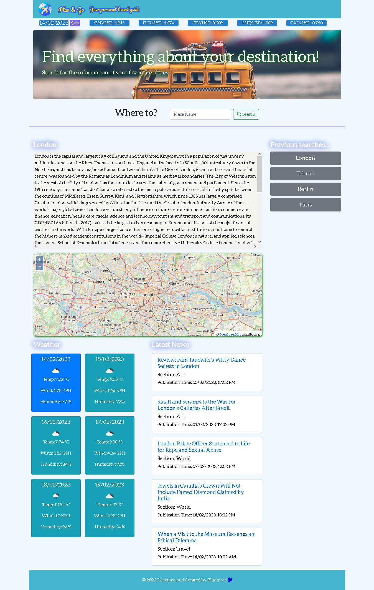

# Plan & Go

## Description
The Plan&Go project is our group project for the stage 1 study at the edX bootcamp for 'Frontend Web Developer'. In this project, we worked in a 3-people group to create a web application thats solves a real-word problem.

## User Story
As a traveler, when I search a city, I want to see the wikipedia description, map, weather and latest news of it. Meanwhile, I want to check the latest currency rates. The previous search can be stored and displayed when I vistied the application next time.

## Team Work
Our group name is Bluebirds, with three members (Vinita, Xiao and Yasha). We work collaboratively on Github. The main branch was protected and any pull request needed at least one memeber to review. 

## Webpage Framework

## Main features
* The application uses 5 APIs, namely OpenCage Geocoding API, Weather API, NYT's API, OpenLayers API and Exchange rates API.

* The webpage uses responsive design based on Bootstrap.

* When the user searches a city, a description from Wikipedia of the city will be rendered to the webpage.

* When the user searches a city, a map of the city will be rendered to the webpage.

* When the user searches a city, the current and future weather for that city will be dispalyed on the webpage. The weather information includes the city name, the date, an icon representation of weather conditions, the temperature, the humidity and the wind speed.

* When the user searches a city, 5 latest news from New York Times will be displayed.

* In addition, the city will be added to the search history if it is not searched before.

* The user can click the history buttons for a quick search of the recorded city. All the information of the city will be rendered to the webpage.

* If the user's input is not valid, the webpage will popup a modal to the user.

## Deployment
Here is the screenshot of the application.

Click the link to test my webpage: 

https://zamanpour.github.io/Plan-Go/

## Contribution
The project was completed by Team Bluebirds.
* Vinita Yadav, yadav.vinita@gmail.com
* Xiao Zhao, zhaoxiao20071106@gmail.com
* Yasha Zamanpour Kolouee, yasha.zamanpour@gmail.com

## Community
It's open-source. Feel free to use it for learning purpose.
